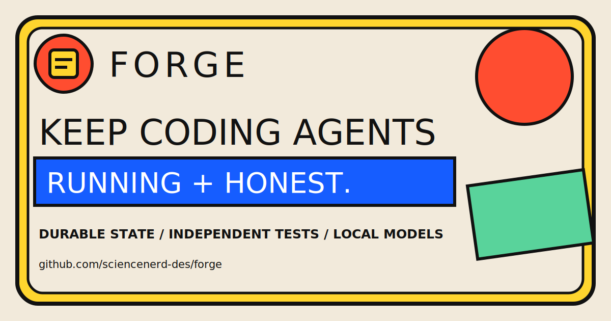

# Forge



**A plug-and-play harness for long-running autonomous coding — with local or cloud models.**

Forge runs a **Planner → Auditor → Executor → Evaluator (PGE)** loop that builds real
software with explicit operator and test gates. It is designed for *small* models (it runs happily on a local
LM Studio / Ollama box) by making the loop reliable rather than clever: every cycle is
checkpointed to a durable store, every "done" is backed by tests the evaluator runs
itself, and no single failed step can take the run down.

> Forge is the open-source extraction of a harness that was hardened over weeks of real
> autonomous runs. Every failure mode we hit is now pinned by a test in
> [`tests/regression/`](tests/regression) — see [docs/LESSONS.md](docs/LESSONS.md).

## Why Forge

- **Truthful completion.** A goal is done only when the evaluator *independently runs*
  the contract's test list and every test passes — never on the model's say-so.
- **Resilient by design.** Durable Postgres state means a node-level bug or a model
  timeout costs a retry, not the whole run.
- **Any OpenAI-compatible backend.** LM Studio, Ollama, vLLM, or a cloud API — one
  `base_url` + `model` + key. Route different models to different loop roles.
- **Plug-and-play.** Nothing is wired to one machine; everything resolves from config.
- **Observable.** A FastAPI control plane + React console show runs, events, and verdicts.

## Quickstart

Requirements: Python 3.11+, Docker (for Postgres), and a running model backend
(e.g. [LM Studio](https://lmstudio.ai) serving an OpenAI-compatible API on `:1234`).

```bash
git clone https://github.com/sciencenerd-des/forge && cd forge
make setup          # venv + install + create .env
# edit .env: point LLM_BASE_URL / LLM_MODEL at your backend
make db             # start Postgres (docker)

# Host command execution is disabled by default. Prefer the Docker workflow below.
# Trusted local experiment only: FORGE_ALLOW_HOST_EXECUTION=1 forge run ...
forge run --goal "Build a Python snake game with tests"
```

That's it — the loop creates a default project, derives a contract, and works the goal
to completion (or pauses as `blocked` for you). Watch it live:

```bash
forge serve         # control-plane API on :8787
make gui            # React console (proxies /api -> :8787)
```

### Pure Docker (no local Python)

```bash
docker compose up -d                              # Postgres + control-plane API
docker compose run --rm forge forge run --goal "..."
```

Compose binds Postgres and the control plane to `127.0.0.1` and supplies a local
development control token. Set a strong `FORGE_CONTROL_TOKEN` before sharing the
machine or placing Forge behind another service.

## Configuration

Everything resolves from environment variables via [`forge_config.py`](forge_config.py);
see [`.env.example`](.env.example) for the full list. Highlights:

| Variable | Purpose | Default |
|---|---|---|
| `LLM_BASE_URL` / `LLM_MODEL` | model backend | `http://localhost:1234/v1`, a local Gemma |
| `PGE_<ROLE>_MODEL` | per-role model routing | falls back to `LLM_MODEL` |
| `DATABASE_URL` | engine Postgres | matches docker-compose |
| `FORGE_HOME` | state / logs / workspaces | `~/.forge` |
| `FORGE_DEFAULT_PROJECT` | pin a project | resolve-or-create |

Run `forge config` to print the resolved configuration.

## How it works

```
planner ─► auditor ─► executor ─► evaluator ─► (planner | end)
              │           │            │
        dual contract  one bounded   RUNS the contract,
        (checklist +   action       verdict from exit codes
        test list)
```

The loop runs in **batches**, each checkpointed to Postgres so it resumes safely;
runs can be launched **detached** to outlive the shell or gateway that started them.
Full design: [ARCHITECTURE.md](ARCHITECTURE.md).

## Development

```bash
make test    # pytest incl. the regression suite
make fmt     # ruff lint/format
```

## Project layout

```
forge_config.py     # single source of truth for paths, DB, providers
forge_cli.py        # `forge` entry point (run / serve / config)
run_pge.py          # the batch loop (attached)
pge_launcher.py     # detached launcher + run manifest
engine/src/         # the PGE graph: planner, auditor, executor, evaluator, steward
app/                # SQLAlchemy models + services (Postgres)
control_plane/      # FastAPI API behind the console
web/                # React 19 + Vite operator console
tests/regression/   # one test per hard-won failure mode
contracts/          # JSON schemas for run snapshots + provider profiles
```

## Roadmap

A Rust `forge` operator CLI (early code in `experimental/`), multi-tenant auth, and a
hosted deployment path. Contributions welcome — see [CONTRIBUTING.md](CONTRIBUTING.md).

Launch messaging, demo scripts, social artwork, and community plans live in
[`docs/marketing/`](docs/marketing/README.md).

## License

[Apache-2.0](LICENSE).
